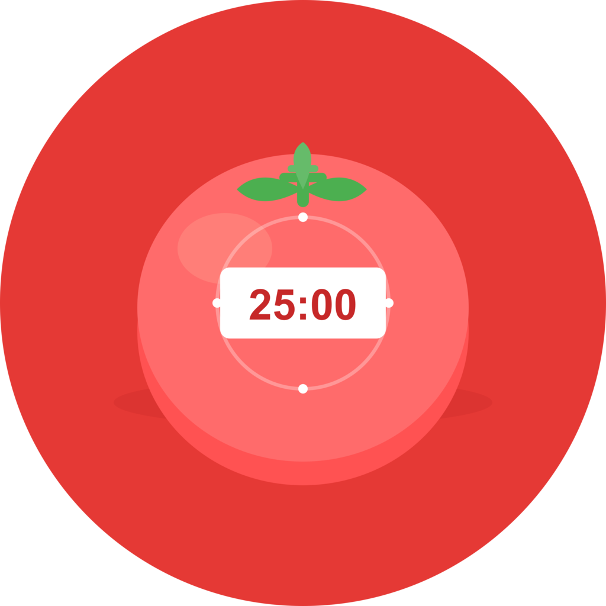

<p align="center">
  
</p>

# Welcome to tiny-pomodoro 👋


[](https://github.com/jellydn/tiny-pomodoro/blob/main/LICENSE)
[](https://twitter.com/jellydn)

> A simple, fast Pomodoro timer app with presets, background operation, and lock screen widgets.

### 🏠 [Homepage](https://github.com/jellydn/tiny-pomodoro)

## Features

- ⏱️ Quick preset buttons: 25, 30, 45, 50 minutes
- 🎯 Circular progress indicator
- 🔔 Sound & vibration notifications
- 📱 Background timer operation
- 🔒 Lock screen widgets (iOS & Android)

## Download

### Android

[](https://github.com/jellydn/tiny-pomodoro/releases/latest)

**Scan QR code to download:**


**Installation:**

1. Download the APK from [Releases](../../releases/latest)
2. On your Android device, go to Settings → Security
3. Enable "Install from unknown sources"
4. Open the downloaded APK to install

### iOS

[](https://github.com/jellydn/tiny-pomodoro/releases/latest)

**Sideloading:**

Use one of these tools to install the IPA on your iPhone:

- [AltStore](https://altstore.io/) - Recommended
- [Sideloadly](https://sideloadly.io/)
- [SideStore](https://sidestore.io/)

> ⚠️ Sideloaded apps need to be refreshed every 7 days with a free Apple ID

**Or build locally with Xcode:**

1. Clone this repository
2. `cd PomodoroTimer`
3. Run `npx expo prebuild --platform ios`
4. Open `ios/PomodoroTimer.xcworkspace` in Xcode
5. Select your iPhone as the target device
6. In Signing & Capabilities, select your Apple ID as "Personal Team"
7. Press ⌘R to build and run

## Prerequisites

- Node.js >= 20
- Bun (recommended) or npm
- EAS CLI (`bun add -g eas-cli`)
- Xcode (for iOS development)

## Install

```sh
cd PomodoroTimer
bun install
```

## Usage

```sh
# Start development server
bun run start

# Run on iOS simulator
bun run ios

# Run on Android emulator
bun run android

# Run on web
bun run web

# Typecheck
npx tsc --noEmit
```

## Releasing a New Version

### Automatic (via GitHub Actions)

1. Create and push a git tag:
   ```sh
   git tag v1.0.0
   git push origin v1.0.0
   ```
2. GitHub Actions will build the APK/IPA and create a release automatically

### Manual Build

```sh
# Build Android APK
npx eas build --platform android --profile preview

# Build iOS IPA
npx eas build --platform ios --profile preview

# Build for production (requires accounts)
npx eas build --platform android --profile production
npx eas build --platform ios --profile production
```

## Setup for CI/CD

1. **EAS Account**: Run `eas login` and authenticate
2. **GitHub Secret**: Add `EXPO_TOKEN` to repository secrets
   - Get token from: https://expo.dev/accounts/[username]/settings/access-tokens

## Author

👤 **Dung Huynh**

- Website: https://productsway.com/
- Twitter: [@jellydn](https://twitter.com/jellydn)
- Github: [@jellydn](https://github.com/jellydn)

## Show your support

Give a ⭐️ if this project helped you!

## License

MIT
